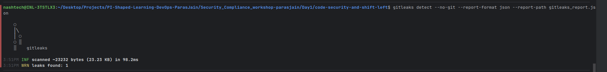
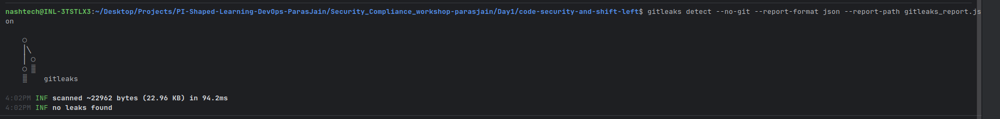
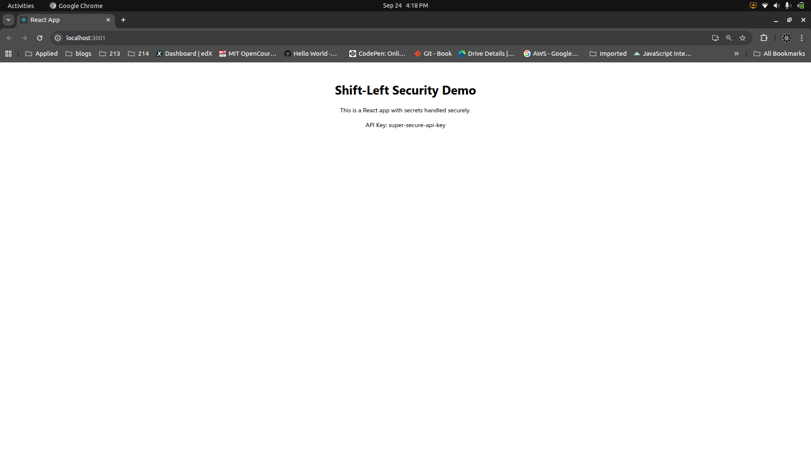

# 🔐 Introduction to DevSecOps & Shift-Left Security

## 📌 Project Overview
This project demonstrates **shift-left security principles** using a simple React application.  
Key objectives:  
- Detect secrets in code using **Gitleaks**  
- Remove secrets and secure them with environment variables  
- Re-scan to ensure the repo is clean  
- Deploy the React app securely inside a **Docker container**  
- Document learnings and best practices  

---

## 🛠️ Setup & Steps

### 1. Initial React App with Hardcoded Secret
A simple React app (`src/App.js`) was created with a **hardcoded API key** for demo purposes:

### 2. Install Gitleaks
```
curl -s https://api.github.com/repos/gitleaks/gitleaks/releases/latest \
| grep "browser_download_url.*linux.*tar.gz" \
| cut -d '"' -f 4 \
| wget -qi - && tar -xvf gitleaks-*.tar.gz
sudo mv gitleaks /usr/local/bin/
```
### 3.Command use to check gitleaks
```gitleaks detect --no-git --report-format json --report-path gitleaks_report.json```
```jsx
// ❌ Insecure code (before fix)
const API_KEY = "REACT_DEMO_SECRET_12345";
```
Before Git Leaks scan, the repo contains this hardcoded secret.


## Remove the hardcoded secret and use environment variables
* Checked Gitleaks output for detected secrets.
* Removed hardcoded secrets and replaced them with environment variables:
* Verified .env file is in .gitignore to avoid accidental commits.

After running Git Leaks scan, it successfully detects the hardcoded


## Working React App with Environment Variables


## Findings
* Git Leaks detected the hardcoded secret in the initial scan.
* After removing the hardcoded secret and using environment variables, a re-scan with Git Leaks showed no detected secrets, confirming the repo is now clean.

## Challenges Faced & Resolutions

|  Challenge |  Resolution |
|---|---|
|Secret detected in multiple files or commits| Identified and removed from all occurrences, used .env files  |
| Ensuring .env not accidentally committed  |  Added .env to .gitignore and verified clean repo with Gitleaks |
| Understanding Gitleaks config & false positives	  |  Used default rules and excluded non-sensitive files |

## Shift-Lift Benefits
- Early detection of secrets reduces risk of exposure in production.
- Encourages secure coding practices among developers.
- Integrates security into the development workflow, promoting a DevSecOps culture.
- Reduces remediation costs by addressing issues early in the SDLC.

## Scenario-Based Questions & Answers

Q1. Explain the concept of shift-left security and why it is important in DevSecOps.

Ans. Shift-left security involves integrating security practices early in the software development lifecycle (SDLC). It is important in DevSecOps because it helps identify and mitigate security vulnerabilities before they reach production, reducing the risk of breaches and ensuring a more secure application.

Q2. How does detecting secrets early in the CI/CD pipeline prevent production vulnerabilities?

Ans. Detecting secrets early prevents them from being exposed in the codebase, which could lead to unauthorized access if the code is leaked. By identifying and removing secrets before deployment, we reduce the risk of security breaches and ensure that sensitive information is handled securely.

Q3. What strategies can be used to store secrets securely instead of hardcoding them?

Ans. Secrets can be stored securely using environment variables, secret management tools (like HashiCorp Vault, AWS Secrets Manager), or encrypted configuration files. These methods ensure that secrets are not exposed in the codebase and can be managed and rotated easily.

Q4. Describe a situation where a secret could still be exposed even after scanning, and how to prevent it.

Ans. A secret could still be exposed if it is committed in a branch that is not scanned or if the scanning tool has false negatives. To prevent this, ensure all branches are scanned, use multiple scanning tools for redundancy, and implement strict code review processes to catch any missed secrets.